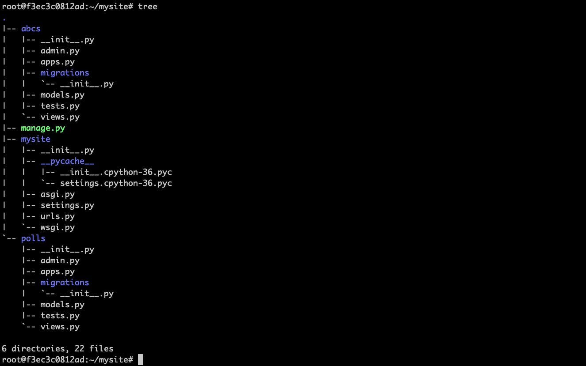

#  B站视频教程    
https://www.bilibili.com/video/BV1ga4y1n7Mp


#  环境准备 - 启动Ubuntu docker

```
docker run -d -P --name django_start     ibackchina2018/ubuntu-sshd-python3:1804
```


##  Portainer 查看端口并登陆或者通过docker ps -a查看

[http://127.0.0.1:9000/#!/1/docker/containers](http://127.0.0.1:9000/#!/1/docker/containers)


其中 55000 是根据电脑不通端口情况而定的：

```
ssh -p 55000 root@127.0.0.1
```

```
passwd  --->   root/root
```
##  进入Ubuntu中操作


```

更新系统包

 apt update
```


```
给python3创建连接

ln -s /usr/bin/python3  /usr/bin/python

```

```
查看连接情况：

 ls -l /usr/bin/  |grep python

发现 python指向了python3

```

```
python -> /usr/bin/python3
```

##  安装 pip3 


```
apt install python3-pip -y
```


```
ln -s /usr/bin/pip3 /usr/bin/pip
```
##  安装Django


```
python -m pip install Django
```

校验版本

```
python -m django --version
```

##  创建项目

```
django-admin startproject mysite
```

验证服务器可用性


```
 python manage.py runserver
```
##  创建投票应用


```
python manage.py startapp polls
```





